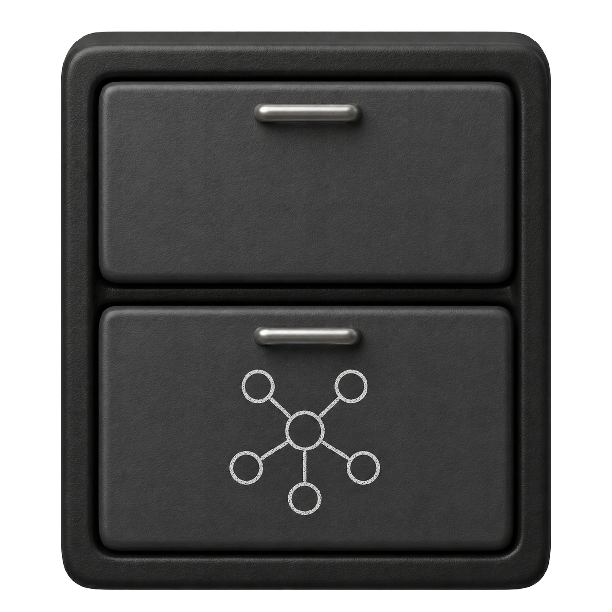

<p align="center">
  
</p>

# Archiver RAG
### The agent-agnostic memory management system through Obsidian-esque techniques

Archiver RAG turns your Obsidian vault into a live, queryable knowledge graph that any MCP-compatible AI agent can search, update, and reorganize — without ever leaving its native interface.

Connect it once. Every agent you use (Claude Code, Cursor, Gemini CLI, or your own) gets semantic search, automatic knowledge logging, wikilink-aware graph traversal, and vault health monitoring out of the box.

---

## How it works

```
Your Obsidian vault (.md files)
         ↓  file watcher + ingest pipeline
     ChromaDB  (persistent vector store)
         ↓  MCP server
     Any MCP-compatible agent
```

Three layers make search smarter than plain embeddings:

1. **Contextual prefix** — each chunk is embedded with its note's metadata (folder, tags, wikilinks), so vectors carry structural context
2. **Rich metadata filtering** — ChromaDB stores folder, tags, incoming link count, and wikilinks for filtered retrieval
3. **Graph reranking** — after vector search, results are re-scored by wikilink proximity to a context note and hub importance

The file watcher runs as a background service. Edit a note in Obsidian, save it, and it's indexed and auto-linked within seconds — no manual sync needed.

---

## Features

- **Semantic search** with graph reranking — finds notes by meaning, then boosts results connected via wikilinks
- **Auto-linking** — after every ingest, appends a `## Related` section with `[[wikilinks]]` to build the knowledge graph automatically
- **Knowledge logging** — create dated, categorized notes (`decision`, `lesson`, `gotcha`, `pattern`, …) from any agent
- **Vault health** — single call returns orphaned notes, broken links, missing frontmatter, tag stats, and recent activity
- **Wikilink-aware reorganization** — move files and every `[[link]]` across the vault is rewritten automatically
- **Smart clustering** — label-propagation algorithm groups notes by wikilink structure and suggests folder organization
- **Agent-agnostic** — exposes a standard MCP interface; works with any MCP-compatible client

---

## Requirements

- Python >= 3.10
- [pipx](https://pipx.pypa.io/) (recommended for installation)
- An Obsidian vault (local `.md` files)
- An MCP-compatible agent (Claude Code, Cursor, etc.)

---

## Installation

```bash
pipx install --editable .
```

> Use `pipx`, not `pip install -e .` — pipx creates an isolated environment and exposes the CLI globally on `PATH`, which is required for MCP registration to find the correct executable.

---

## Setup

Run the one-time setup wizard:

```bash
archiver-rag init
```

This will:
1. Ask for your vault path
2. Index your vault into ChromaDB
3. Register the MCP server in `~/.claude.json` (or prompt you to do it manually for other clients)
4. Install the background watcher as a launchd agent (Mac) or systemd service (Linux)

---

## MCP registration (manual)

If you prefer to register manually, add this to your MCP client config:

```json
{
  "mcpServers": {
    "archiver-rag": {
      "command": "/path/to/archiver-rag",
      "args": ["serve"]
    }
  }
}
```

Find the executable path with `which archiver-rag`.

For Claude Code specifically, use:

```bash
claude mcp add --scope user archiver-rag $(which archiver-rag) serve
```

---

## CLI reference

```bash
archiver-rag init              # one-time setup wizard
archiver-rag start             # start the background watcher service
archiver-rag stop              # stop the service
archiver-rag restart           # restart the service
archiver-rag status            # check if service is running
archiver-rag index             # force re-index the entire vault
archiver-rag search "query"    # test semantic search from the terminal
archiver-rag health            # chunk count and index peek
archiver-rag logs              # tail the service log

# Knowledge logging
archiver-rag log "Title" --type decision --tag arch --related NoteA

# Clustering
archiver-rag cluster                      # suggest folder groupings
archiver-rag cluster --apply              # move files automatically
archiver-rag place <note>                 # suggest folder for a single note
archiver-rag place <note> --apply         # move it immediately

# Config
archiver-rag config --auto-cluster        # enable auto-clustering in the watcher
archiver-rag config --cluster-threshold 5 # notes before a full re-cluster

archiver-rag uninstall         # remove all data, service, and MCP registration
```

---

## MCP tools (for agents)

Once registered, agents have access to 7 tools:

| Tool | What it does |
|---|---|
| `search_vault` | Semantic search with graph reranking. Accepts a `context_note` to boost wikilink neighbors. |
| `vault_status` | Vault structure, health diagnostics, tag stats, and recent activity in one call. |
| `get_connections` | BFS wikilink traversal — outgoing and incoming links up to depth 3. |
| `move_notes` | Move files and auto-rewrite all `[[wikilinks]]` across the vault. |
| `log_note` | Create a dated knowledge note; watcher indexes and auto-links it immediately. |
| `cluster_note` | Suggest a folder for one note based on where its wikilink neighbors live. |
| `cluster_vault` | Label-propagation clustering of the entire vault with folder suggestions. |

---

## Configuration

All runtime config lives at `~/.archiver-rag/config.json`:

```json
{
  "vault_path": "/path/to/your/vault",
  "install_path": "/Users/you/.archiver-rag",
  "chroma_path": "/Users/you/.archiver-rag/chroma_db",
  "auto_cluster": false,
  "cluster_threshold": 5
}
```

`auto_cluster` — automatically suggest and apply folder placement for new notes via the watcher.  
`cluster_threshold` — number of new notes created before triggering a full `cluster_vault` run.

---

## The knowledge graph model

The vault is treated as a **knowledge graph**, not a file hierarchy. Notes are nodes; wikilinks are edges. Relationships range from tight (direct links) to loose (semantic proximity surfaced by search).

Note types are expressed through frontmatter, not folder structure:

```yaml
---
type: decision
tags: [architecture, async]
related: [[AsyncLocalStorage]], [[PrismaExtensions]]
date: 2026-04-27
---
```

The `## Related` section at the bottom of each note is managed automatically by the auto-linker after every ingest. Don't edit it manually — it will be overwritten.

---

## License

MIT
